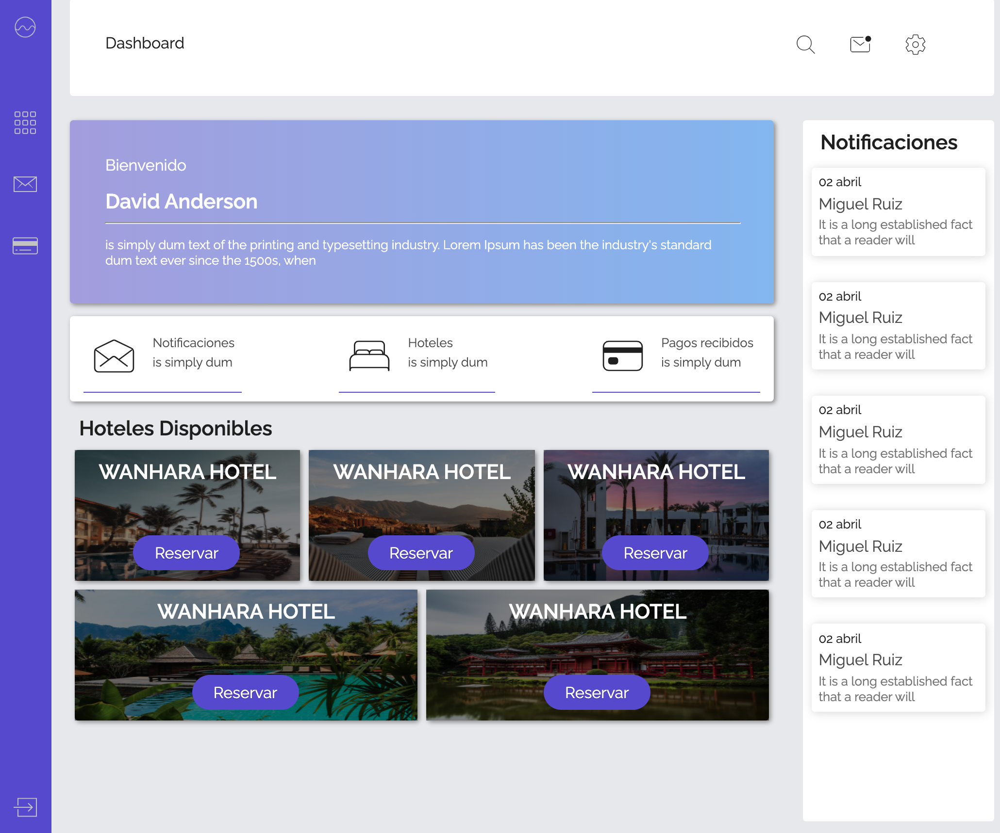

<p>
    <h1 align="center"> Test Reacjs </h1>
    <h3 align="center">Cargo Front End</h3>
     <p align="center">
        
    </p>
</p>


<h2>Instrucciones:</h2>

1. Hacer un fork a su repositorio

2. Descargar y cumplir con documento de test recibido

3. Una vez descargado el proyecto encontrarás la siguiente estructura de carpetas

```
.
├── README.md
├── api
├── src
│   ├── ccs
│   ├── components
│   ├── store
│   ├── views
│   ├── App.js
│   └── index.js
└── package.json

```

4.- Instalar las dependencias

```
yarn install

```

5.- En la raíz de sitio se encuentra configurado para que ejecute 2 tareas, levantar un API Mock y el sitio utilizando create-react-app

```
yarn start
```
